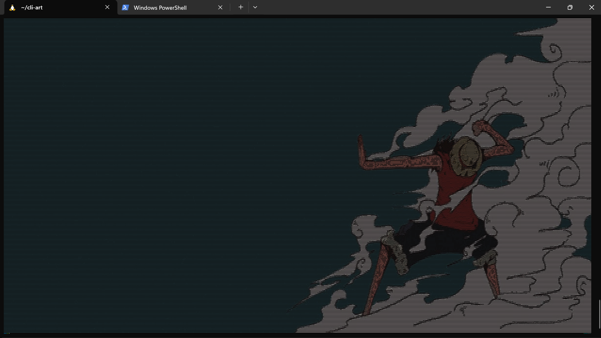

## 🚀 Download

You can download the latest release from below.

| Operating System | Download |
| :--- | :--- |
| **Windows** | [Download .exe](https://github.com/yogi1308/cli-art/releases/download/v1.0/cli-art-windows.exe) |
| **Linux (Ubuntu-based / WSL)** | [Download binary](https://github.com/yogi1308/cli-art/releases/download/v1.0/cli-art) |

## 🤔 What it does
Converts an image to ascii art inside your terminal. It is recommended to view the image with terminal maximized and zoomed out as much you can. The program reads the width of your screen to make sure the output fits it so type it the commmand and then zoom out completely and then press enter.


## 💻 How to Use

This is a command-line tool, so you must run it from a terminal (like PowerShell, Command Prompt, or your Linux/WSL terminal).

1.  Download the correct executable for your system from the Releases page.
2.  Move the downloaded file into a folder (e.g., your `Downloads` folder).
3.  Open your terminal and navigate (`cd`) into that folder.
    ```bash
    # Example for Windows
    cd C:\Users\Yogi\Downloads
    
    # Example for Linux/WSL
    cd /home/yogi/Downloads
    ```
4.  **(Linux/WSL Only):** You must make the file executable first.
    ```bash
    chmod +x cli-art
    ```
5.  Run the program! You must give it a path to an image file or a URL.
    ```bash
    # Example for Windows
    cli-art-windows.exe my-picture.jpg
    
    # Example for Linux/WSL
    ./cli-art my-picture.jpg
    ```

## ✨ Options & Examples

You can get a full list of all commands by running the program with the `--help` or `-h` flag.

```bash
# Windows
./cli-art-windows.exe --help

# Linux
./cli-art --help
```
Basic From a local file
```bash
# Linux
./cli-art image.png
# Windows
./cli-art-windows.exe image.png
```
From a URL (remember to use quotes!):
```bash
# Linux
./cli-art "https://i.pinimg.com/1200x/95/36/8e/95368ef6621659a09e8f2d1387c7fb8a.jpg"
# Windows
./cli-art-windows.exe "https://i.pinimg.com/1200x/95/36/8e/95368ef6621659a09e8f2d1387c7fb8a.jpg"
```
Full Color(if b&w then remeber to use quotes!) and Custom Width:
```bash
# Linux
./cli-art image.png --width 100 --img-color "b&w"
# Windows
./cli-art-windows.exe image.png --width 100 --img-color "b&w"
```
Green Text, Inverted, and "Average" Brightness:
```bash
# Linux
./cli-art image.png --img-color green --invert --conversion-type average
# Windows
./cli-art-windows.exe image.png --img-color green --invert --conversion-type average
```

High Contrast:
```bash
# Linux
./cli-art image.png --contrast 2.5
# Windows
./cli-art-windows.exe --contrast 2.5
```
## ✨ Command-Line Options

Here is the full list of arguments you can use. Remember you can see this menu at any time by running `./cli-art --help`.

| Argument | Default | Description |
| :--- | :--- | :--- |
| `filepath` | **(Required)** | **Required.** The path to the input image file (e.g., `./image.png`) or a URL. |
| `-h`, `--help` | - | Show this help message and exit. |
| `--img-color` | 'colored' | Set the output color. Options: 'black', 'red', 'green', 'yellow', 'blue', 'magenta', 'cyan', 'white', or an RGB string like "255,100,20" or "b&w" or "colored"|
| `--invert` | - | Invert the brightness (light <-> dark). Good for light terminal backgrounds. |
| `--width` | (auto-fit) | Set a specific width in pixels (e.g., 100). This will override the `--fit` setting. |
| `--fit` | 'height' | Auto-fit to terminal 'height' or 'width'. |
| `--conversion-type` | 'luminosity' | How to calculate brightness: 'luminosity' (best), 'average', or 'min-max'. Determines how rgb values of each pixel are converted to ascii |
| `--contrast` | 1.0 | Enhance image contrast. >1.0 for more, <1.0 for less. |
